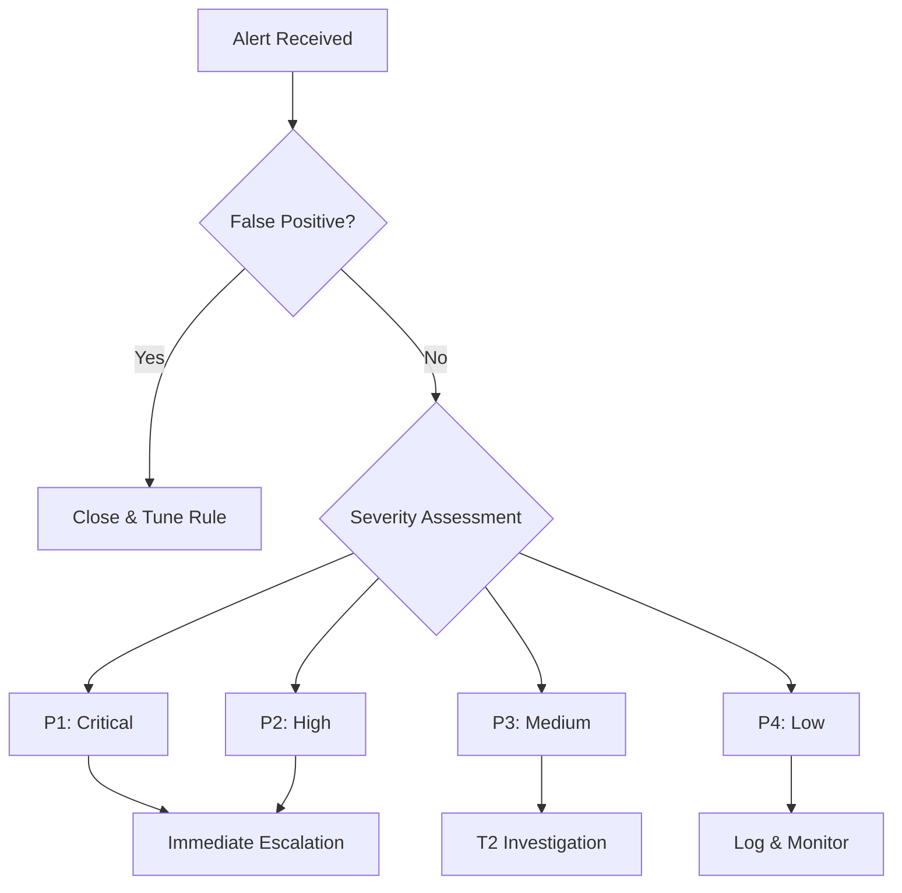

# Blue Team Defense Repository

## 📋 Table of Contents
- [Introduction](#introduction)
- [Defense Framework](#defense-framework)
- [Tools by Category](#tools-by-category)
- [Detection & Analysis Procedures](#detection--analysis-procedures)

---

## Introduction

This repository contains essential resources for blue team activities during MICAC graduation attack-defense exercise. It follows the NIST 800-61 Rev3 framework and provides practical tools, procedures, and playbooks for effective incident detection, analysis, and response.

### Defense Objectives
- **Detect** threats early using comprehensive monitoring
- **Analyze** incidents efficiently with proper tooling
- **Respond** rapidly following established playbooks
- **Recover** systems to normal operations
- **Learn** from incidents to improve defenses

---

## Defense Framework

The Defense strategy is based on the **NIST Cybersecurity Framework 2.0**:

```
┌─────────────────────────────────────────────────────────────┐
│                    DEFENSE LIFECYCLE                        │
├─────────────┬──────────────┬──────────────┬─────────────────┤
│   GOVERN    │   IDENTIFY   │   PROTECT    │     DETECT      │
├─────────────┴──────────────┴──────────────┴─────────────────┤
│                    RESPOND & RECOVER                        │
└─────────────────────────────────────────────────────────────┘
```

### Key Phases - Blue Team (Defence)

#### 1. **Preparation** (Before the Exercise)
- Asset inventory
- Sensor deployment
- Baseline establishment
- Playbook review

#### 2. **Detection** (During the Exercise)
- Real-time monitoring
- Alert triage
- Threat hunting
- IOC correlation

#### 3. **Response** (Active Incident)
- Containment
- Eradication
- Recovery
- Communication

#### 4. **Post-Incident** (After the Exercise)
- Lessons learned
- Metrics analysis
- Playbook updates
- Knowledge sharing

---

## Tools by Category

### 🔍 Detection & Monitoring

#### SIEM Platforms
| Tool | Type | Purpose | Quick Start |
|------|------|---------|-------------|
| **Wazuh** | Open-source SIEM/XDR | Centralized log management, threat detection, compliance | `systemctl start wazuh-manager` |
| **Splunk** | Commercial SIEM | Advanced analytics, correlation | Access web UI at `http://localhost:8000` |
| **Elastic Stack (ELK)** | Open-source | Log aggregation, visualization | `docker-compose up -d` |
| **Microsoft Sentinel** | Cloud SIEM | Azure-integrated detection | Configure in Azure Portal |
| **Security Onion** | Linux distro | Network security monitoring | Boot from ISO, run Setup |

#### Network Monitoring
| Tool | Purpose | Command Example |
|------|---------|-----------------|
| **Zeek (Bro)** | Network traffic analysis | `zeek -i eth0 local` |
| **Suricata** | IDS/IPS with signature detection | `suricata -c /etc/suricata/suricata.yaml -i eth0` |
| **Wireshark** | Packet capture and analysis | `wireshark` or `tshark -i eth0` |
| **tcpdump** | Lightweight packet capture | `tcpdump -i eth0 -w capture.pcap` |
| **Arkime (Moloch)** | Full packet capture | Access web UI after setup |

#### Endpoint Detection
| Tool | Purpose | Platform |
|------|---------|----------|
| **Sysmon** | Windows event logging | Windows |
| **Auditd** | Linux system call auditing | Linux |
| **Osquery** | Endpoint querying | Cross-platform |
| **Wazuh Agent** | Host-based detection | Cross-platform |

---

### 🛡️ Protection & Hardening

#### Host-Based Security
| Tool | Purpose | Usage |
|------|---------|-------|
| **ClamAV** | Antivirus scanning | `clamscan -r /home` |
| **AIDE** | File integrity monitoring | `aide --check` |
| **Fail2Ban** | Intrusion prevention | `fail2ban-client status` |
| **AppArmor/SELinux** | Mandatory access control | `aa-status` / `sestatus` |

#### Network Security
| Tool | Purpose | Configuration |
|------|---------|---------------|
| **iptables/nftables** | Firewall | `/etc/iptables/rules.v4` |
| **pfSense** | Network firewall/router | Web GUI configuration |
| **ModSecurity** | Web application firewall | Apache/Nginx module |

---

### 📊 Analysis & Investigation

#### Forensics Tools
| Tool | Purpose | Example Command |
|------|---------|-----------------|
| **Volatility** | Memory analysis | `volatility -f memory.dump imageinfo` |
| **Autopsy** | Disk forensics | GUI-based analysis |
| **Sleuth Kit** | File system analysis | `fls -r disk.img` |
| **Rekall** | Memory forensics | `rekall -f memory.dump pslist` |

#### Malware Analysis
| Tool | Type | Purpose |
|------|------|---------|
| **Cuckoo Sandbox** | Dynamic analysis | Automated malware behavior analysis |
| **YARA** | Static analysis | Pattern matching rules |
| **VirusTotal** | Threat intelligence | File/URL reputation checking |
| **ANY.RUN** | Interactive sandbox | Real-time malware analysis |

#### Log Analysis
| Tool | Purpose | Command |
|------|---------|---------|
| **grep/awk/sed** | Text processing | `grep "Failed password" /var/log/auth.log` |
| **jq** | JSON parsing | `cat logs.json \| jq '.events[]'` |
| **Logstash** | Log processing | Part of ELK stack |

---

### 🔄 Response & Automation

#### SOAR Platforms
| Tool | Capabilities | Use Case |
|------|--------------|----------|
| **Splunk SOAR (Phantom)** | Playbook automation | Enterprise response orchestration |
| **TheHive** | Case management | Incident tracking and collaboration |
| **Cortex** | Observable analysis | Integration with TheHive |
| **Shuffle** | Open-source SOAR | Workflow automation |

#### Scripting & Automation
```bash
# Python libraries for automation
pip install pymisp           # MISP threat intelligence
pip install thehive4py       # TheHive API
pip install requests         # HTTP requests
pip install pandas           # Data analysis
```

---

### 🔎 Threat Intelligence

#### CTI Platforms
| Platform | Type | Access |
|----------|------|--------|
| **MISP** | Open-source TIP | Self-hosted or community instances |
| **OpenCTI** | Open-source CTI | Graph-based intelligence platform |
| **AlienVault OTX** | Community TI | Free API access |
| **VirusTotal** | File/URL intelligence | API and web interface |

#### IOC Feeds
- **MITRE ATT&CK**: [attack.mitre.org](https://attack.mitre.org)
- **Abuse.ch**: Malware IOCs (URLhaus, MalwareBazaar)
- **EmergingThreats**: Suricata/Snort rules
- **CISA KEV**: Known Exploited Vulnerabilities

---

## Detection & Analysis Procedures

### 🎯 Alert Triage Workflow



### Triage Questions Checklist

#### Initial Assessment
- Is this a true positive or false positive?
- What asset(s) are affected?
- What is the asset criticality? (Low/Medium/High)
- What is the threat severity? (Low/Medium/High/Critical)
- Is the incident ongoing or historical?

#### Scope Determination
- How many systems are affected?
- What data is potentially compromised?
- Are there lateral movement indicators?
- What is the timeline of events?

#### Impact Analysis
- What processes are affected?
- Is there data exfiltration evidence?
- What is the impact estimate?

---

### 🔍 Investigation Methodology

Follow the **OODA Loop**:

```
┌─────────────────────────────────────┐
│  OBSERVE → ORIENT → DECIDE → ACT    │
│            ↑__________________|     │
└─────────────────────────────────────┘
```

#### 1. Observe
**Collect data from multiple sources:**

```bash
# Check Wazuh alerts
curl -u user:pass -XGET "https://<wazuh-url>:55000/security/alerts?limit=100"

# Query Splunk
index=windows EventCode=4624 | stats count by user

# Review Zeek logs
cat /opt/zeek/logs/current/conn.log | zeek-cut id.orig_h id.resp_h proto service
```

#### 2. Orient
**Contextualize with threat intelligence:**

- Check IOCs against MISP/OpenCTI
- Map to MITRE ATT&CK techniques
- Review similar historical incidents
- Assess user/entity behavior (UEBA)

#### 3. Decide
**Determine response action:**

- Containment strategy
- Forensic data preservation needs
- Communication requirements
- Legal/compliance considerations

#### 4. Act
**Execute response:**

- Follow incident playbook
- Document all actions
- Maintain chain of custody
- Update case management system

---

### 📈 Detection Use Cases

#### Use Case 1: Suspicious PowerShell Execution

**Detection Rule (Splunk):**
```spl
index=<os_log> EventCode=4688 
| where match(CommandLine, "(?i)(encodedcommand|bypass|noprofile)")
| stats count by ComputerName, User, CommandLine
| where count > 0
```

**Investigation Steps:**
1. Review full command line
2. Check parent process
3. Analyze process creation time
4. Search for file modifications
5. Check network connections from process

#### Use Case 2: Brute Force Attack

**Detection Rule (Sigma format):**
```yaml
title: Multiple Failed Login Attempts
status: stable
logsource:
  product: linux
  service: auth
detection:
  selection:
    event: 'Failed password'
  condition: selection
  timeframe: 5m
  count: 
    - '>= 5'
    - by: src_ip
level: medium
```

**Response Actions:**
1. Identify source IP
2. Check threat intelligence feeds
3. Block IP at firewall
4. Force password reset for targeted accounts
5. Enable MFA if not present

#### Use Case 3: Data Exfiltration

**Detection Indicators:**
- Large outbound data transfers
- Connections to unusual external IPs
- Data compression before transfer
- Off-hours activity

**Investigation Query (Zeek logs):**
```bash
# Find large data transfers
zeek-cut ts id.orig_h id.resp_h proto orig_bytes < conn.log | \
  awk '$5 > 1000000000' | sort -n -k5
```